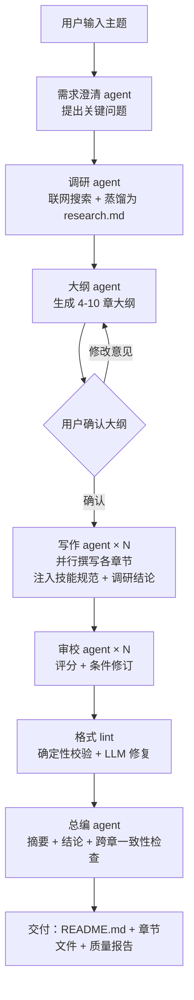

# tech-doc-agent：技术方案多 Agent 写作系统

输入任意技术主题，系统自动走完 **联网调研 → 需求澄清 → 大纲确认 → 多 agent 并行撰写 → 审校修订 → 格式校验 → 合并交付** 的完整流水线，产出一份有事实依据、带架构图/伪代码、格式经过校验的专业技术方案文档。模型厂商可自由配置，任何 OpenAI 兼容 API 都能接入。

## 系统架构



## 安装

```bash
cd tech-doc-agent
pip install -r requirements.txt   # openai SDK + ddgs（DuckDuckGo 搜索）
cp config.example.json config.json
```

## 配置模型

编辑 `config.json`，每个 profile 是一个模型厂商。api_key 支持 `${环境变量}` 引用：

```json
{
  "default": "deepseek",
  "profiles": {
    "deepseek": { "base_url": "https://api.deepseek.com", "api_key": "${DEEPSEEK_API_KEY}", "model": "deepseek-chat" }
  },
  "search": { "backend": "duckduckgo", "tavily_api_key": "${TAVILY_API_KEY}" }
}
```

已预置 deepseek / kimi / qwen / openai / local(Ollama) 五个示例。搜索后端默认 DuckDuckGo（免费免 key），也可切换 Tavily（`"backend": "tavily"` 并配置 key）。

## 使用

```bash
# 完整流程（推荐）：澄清提问 → 联网调研 → 大纲确认 → 并行写作 → 审校 → 格式校验
python main.py "Kubernetes 集群高可用方案"

# 指定模型
python main.py "RAG 检索增强方案设计" --profile kimi

# 编排/写作/审校用不同模型（强模型做编排审校，便宜模型写章节，控制成本）
python main.py "..." --orchestrator-profile kimi --writer-profile deepseek --reviewer-profile kimi

# 非交互模式：跳过提问和确认，一键生成到底（适合脚本调用）
python main.py "..." --auto

# 省钱快跑：关闭调研和审校
python main.py "..." --no-research --no-review

# 自备调研材料：不触发任何联网搜索，直接用你调研好的文件
# （适合不方便让模型联网的场景——自己用其他工具调研，存成 md 喂给它）
python main.py "..." --research-file my-research.md

# 调整并行度 / 输出目录
python main.py "..." --workers 8 --output my_docs
```

## 产出

```
docs/<主题>-<日期>/
├── README.md               # 最终合并文档：摘要 + 目录 + 全部章节 + 结论与风险
├── 01-xxx.md               # 各章节独立文件
├── 02-xxx.md
├── research.md             # 联网调研笔记（带来源 URL）
├── outline.json            # 大纲存档
├── quality-report.md       # 质量报告：各章 lint 结果 + 全文校验 + 一致性检查
└── consistency-report.md   # 跨章一致性检查（开启审校时生成）
```

## 流水线与质量保障

| 阶段 | 执行者 | 行为 |
|---|---|---|
| 0. 联网调研 | orchestrator + searcher | 生成搜索词 → 联网检索 → 蒸馏为带来源的调研笔记 |
| 1. 需求澄清 | orchestrator | 生成 2-4 个关键问题，交互收集回答 |
| 2. 大纲 | orchestrator | 产出 4-10 章技术方案大纲，用户确认或提意见迭代 |
| 3. 章节撰写 | writer × N | 每章一个 agent 并行撰写，按章节类型注入技能规范 |
| 3.5 审校 | reviewer × N | 按清单评分（可落地性/事实/格式/图表/一致性），不达标由 writer 修订一轮 |
| 3.6 格式校验 | format lint | 确定性校验：围栏闭合、Mermaid 语法、标题层级、伪代码/架构图必备项、引用覆盖；error 时 LLM 修复一次（修复更差自动回退） |
| 4. 合并交付 | orchestrator | 摘要 + 结论与风险 + 跨章一致性检查，合并为 README.md |

## 技能库（skills/）

章节写作时按标题关键词自动注入对应的写作规范：

| 技能文件 | 触发章节 | 内容 |
|---|---|---|
| `markdown-format.md` | 全部章节（强制） | Markdown 硬性规范、`[来源: URL]` 引用格式 |
| `architecture-diagram.md` | 架构/设计/流程 | Mermaid 架构图与时序图规范，架构章至少 1 张图 |
| `pseudocode.md` | 架构/设计/流程 | pseudo 代码块伪代码规范，设计章至少 1 段 |
| `adr-tradeoff.md` | 选型/对比 | 方案对比表 + 明确推荐结论 |
| `slo-capacity.md` | 容量/性能/SLO | QPS/存储估算公式、SLO 指标表（可用性/P99/RTO/RPO） |
| `ha-dr.md` | 高可用/容灾/稳定性 | 单点分析、故障场景表、多副本/多机房方案 |

可在 `skills/` 下新增 `.md` 文件并在 `skills/loader.py` 的 `CHAPTER_SKILL_RULES` 里登记，即可扩展新技能。

## 工具层（tools/）

`tools/web_search.py` 提供可插拔搜索后端（DuckDuckGo / Tavily），统一接口 `search(query, max_results)`。按同样接口可在 `tools/` 下扩展新工具（包括接入 MCP server 的适配器），然后在 `pipeline.py` 对应阶段注入。

## 测试

```bash
python tests/mock_e2e.py   # 离线 mock 端到端测试，不需要 API key
```

## 环境要求

Python 3.8+。
